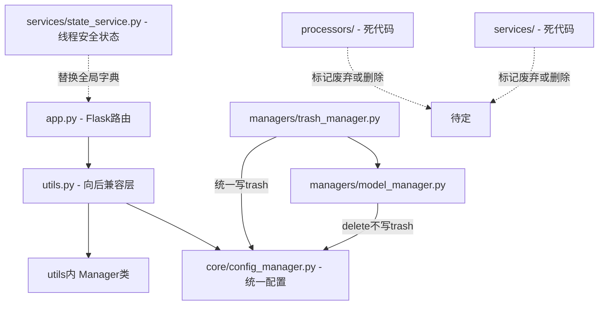

## 产品概述

对 AI Summary 项目进行全面代码审查，检查并修复所有逻辑错误、语法缺陷、潜在运行时异常，重点关注健壮性、边界条件、性能和安全性隐患。

## 核心功能

- 审查并修复线程安全问题（全局状态、配置管理器）
- 修复双重回收站写入导致的重复数据问题
- 修复错误处理缺陷（错误字符串被当作成功响应处理）
- 修复配置管理器的浅拷贝和点号路径与列表索引冲突问题
- 清理安全隐患（API Key 明文存储、硬编码密钥、目录遍历、CSRF）
- 清理代码质量问题（死代码、裸 except、未使用导入、重复代码、同名类冲突、测试数据）
- 统一 providers 数据格式，消除新旧代码重复

## 技术栈

- 后端框架: Python 3 + Flask
- AI SDK: OpenAI Python SDK
- 配置管理: JSON 文件 + 单例模式 ConfigManager
- 并发模型: threading（后台处理线程）
- 部署: Docker + Gunicorn

## 实现方案

### 修复策略

按照严重程度分批修复，每批确保不引入新问题：

1. **严重级别**：线程安全、双重回收站、错误处理——这些会导致数据损坏或运行时崩溃
2. **重要级别**：配置管理器缺陷——影响数据一致性和正确性
3. **中等级别**：代码清理和重复消除——提升可维护性
4. **低级别**：安全加固和边界情况——提升安全性

### 关键技术决策

**线程安全修复**：采用现有的 `services/state_service.py` 中的 `ProcessingState` 替换 `app.py` 中的全局字典，因为它已经实现了完整的线程安全操作（带锁的 get/update/cancel 等），避免重新发明轮子。

**双重回收站修复**：`trash_manager.py` 的 `move_provider_to_trash()` 调用 `model_manager.delete()`，而 `model_manager.delete()` 自身也会把数据写入 trash（第 115-119 行），导致数据被写入回收站两次。修复方案：将 `model_manager.delete()` 改为只从 providers 列表中移除，不写 trash，trash 写入由 `trash_manager` 统一负责。

**错误处理修复**：`utils.py` 的 `process_file` 和 `save_response` 捕获异常后返回错误字符串，调用方（`app.py:329-330`）无法区分成功和失败，会把错误字符串保存为 .md 文件。修复方案：改为抛出自定义异常 `FileProcessingError`，在 `app.py` 的 `run_processing_task` 中统一捕获。

**ConfigManager 浅拷贝修复**：`get()` 返回 `self._cache.copy()` 是浅拷贝，嵌套对象（如 providers 列表）可被外部修改破坏内部缓存。修复方案：使用 `copy.deepcopy()`。

**点号路径与列表冲突修复**：`set()` 方法遍历 `keys[:-1]` 时遇到数字键创建字典而非保持列表结构。修复方案：当当前值为列表且 key 为数字时，用索引访问列表；当 key 不存在且父级为列表时，按索引赋值。

### 架构调整



## 实现细节

### 性能注意事项

- `copy.deepcopy()` 在 `get()` 中每次调用都有开销，但配置读取频率不高，且数据量小（KB级），影响可忽略
- `ProcessingState` 的 `get_dict()` 已有深拷贝 results 的逻辑，无额外性能问题

### 日志注意事项

- 修复后统一使用 `core/logger.py` 的 `get_logger()`，逐步替换 `debug_print`
- 错误日志不包含 API Key 等敏感信息

### 爆炸半径控制

- `utils.py` 的向后兼容函数被 `app.py` 大量引用，修改 `FileManager.process_file` 和 `FileManager.save_response` 的异常行为会影响 `app.py:329` 的调用链，需同步修改
- `model_manager.delete()` 的修改影响 `trash_manager.move_provider_to_trash()`，需确保 trash 写入逻辑仍在 trash_manager 中

## 目录结构

```
d:/git/ai_summary/
├── app.py                              # [MODIFY] 替换 processing_state 为 ProcessingState 单例; 修复 debug_print 级别逻辑; 删除 import shutil; 修复裸 except; 提取取消检查为辅助函数; 修复 process_file/save_response 调用的错误处理; 增加 CSRF 保护; 限制目录遍历
├── utils.py                            # [MODIFY] FileManager.process_file 改为抛异常; FileManager.save_response 改为抛异常; 清理重复代码
├── config.json                         # [MODIFY] 移除 API Key 明文(改为空字符串); 删除测试数据 new_key/a.b.c
├── core/
│   ├── config_manager.py               # [MODIFY] get() 改用 deepcopy; set() 修复列表索引处理; 添加线程锁; 修复相对路径为绝对路径; 添加 reset 类方法便于测试
│   └── logger.py                       # 无需修改
├── managers/
│   ├── model_manager.py                # [MODIFY] delete() 方法移除 trash 写入，仅从 providers 列表中移除
│   ├── trash_manager.py                # [MODIFY] 保持不变（已统一负责 trash 写入）
│   └── prompt_manager.py               # 无需修改
├── services/
│   └── state_service.py                # 无需修改（已有完整实现）
├── processors/
│   └── (死代码，暂不删除，添加废弃注释)
└── requirements.txt                    # [MODIFY] 添加 Flask-WTF 用于 CSRF 保护
```

## 关键代码结构

```python
# core/config_manager.py - 线程安全 + deepcopy + 列表索引支持
class ConfigManager:
    _instance = None
    _lock = threading.Lock()  # 新增：类级别锁
    _config_path: Path = Path(__file__).parent.parent / "config.json"  # 修复：绝对路径
    _cache: Dict = None
    _loaded: bool = False

    def __new__(cls):
        with cls._lock:  # 线程安全单例
            if cls._instance is None:
                cls._instance = super().__new__(cls)
            return cls._instance

    def get(self, key=None, default=None) -> Any:
        # 返回 copy.deepcopy(self._cache) 或 deepcopy 子值

    def set(self, key, value) -> bool:
        # 支持 providers.0.name 形式的列表索引访问
        # 写文件时加 self._lock

    @classmethod
    def reset(cls):  # 新增：便于测试重置
        cls._instance = None
        cls._cache = None
        cls._loaded = False
```

```python
# app.py - 使用 ProcessingState 替换全局字典
from services.state_service import ProcessingState

processing_state = ProcessingState()  # 替换全局字典

def run_processing_task(...):
    state = ProcessingState()
    state.start()
    # ... 取消检查改为 state.is_cancelled()
    # ... 状态更新改为 state.update_progress() / state.add_result() / state.complete() / state.set_error()

@app.route('/get_processing_status')
def get_processing_status():
    return jsonify(ProcessingState().get_dict())

@app.route('/cancel_processing')
def cancel_processing():
    state = ProcessingState()
    if not state.is_running():
        return jsonify({'status': 'error', 'message': '...'}), 400
    state.cancel()
    return jsonify({'status': 'cancelled', 'message': '...'})
```

```python
# utils.py - process_file / save_response 改为抛异常
class FileManager:
    @staticmethod
    def process_file(file_path, client, system_prompt, model_id):
        # ... 成功返回 response_content
        # 失败时 raise FileProcessingError(error_msg) 而非 return error_msg

    @staticmethod
    def save_response(file_path, response):
        # ... 成功返回 md_path
        # 失败时 raise FileProcessingError(error_msg) 而非 return error_msg
```